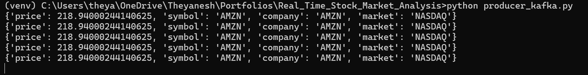
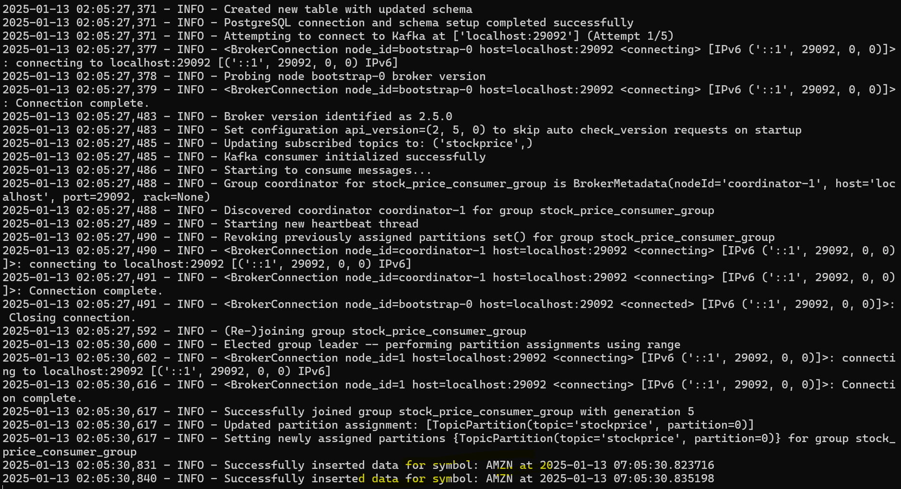
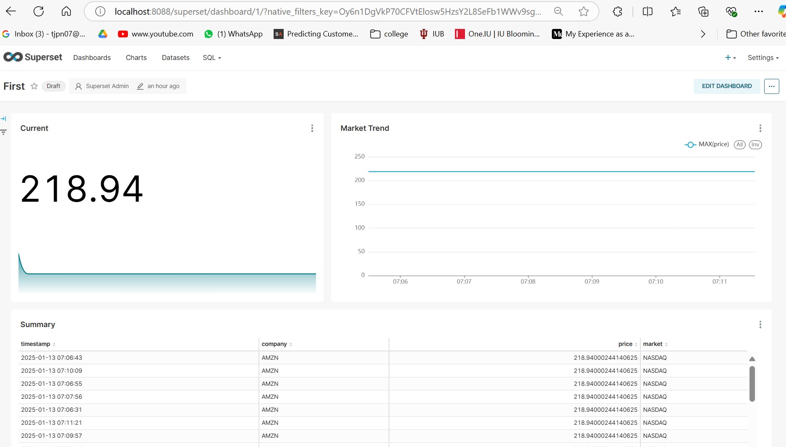

# Real-Time Stock Market Analysis for Amazon

## Overview

This project demonstrates how to analyze Amazon's stock market data in real-time. The real-time stock data is fetched using Yahoo Finance's yfinance API, streamed via Kafka, stored in a PostgreSQL database, and visualized using Apache Superset. This setup allows you to observe trends and make informed decisions based on live stock data.

### Key Technologies:
- **Yahoo Finance API**: Fetches live stock data.
- **Kafka**: Handles real-time data streaming.
- **PostgreSQL**: Stores stock data for historical analysis.
- **Apache Superset**: Visualizes stock data through interactive charts and dashboards.

## Features

- **Real-Time Data Fetching**: Pulls Amazon's stock market data every minute using the yfinance API.
- **Kafka Streaming**: Streams data to Kafka, ensuring scalability and real-time processing.
- **Database Ingestion**: Consumes Kafka streams and stores data in PostgreSQL.
- **Data Visualization**: Uses Apache Superset to create visualizations such as price trends, volume analysis, and more.

## Requirements

Before getting started, ensure you have the following installed:

- **Docker**: For setting up Kafka, PostgreSQL, and Apache Superset in containers.
- **Python 3.x**: To run the scripts for data fetching, streaming, and consumption.


# Getting Started

## 1. Clone the Repository
Clone the repository to your local machine:

```bash
git clone <repository-url>
cd <repository-directory>
```

## 2. Create a Virtual Environment
Create a Python virtual environment to isolate the project's dependencies:
```bash
python -m venv venv
```
Activate the virtual environment (Windows):
```bash
.\venv\Scripts\activate
```

## 3. Install Dependencies
```bash
pip install -r requirements.txt
```

## 4. Set Up Docker Containers
```bash
docker-compose up
```
This will start Kafka, PostgreSQL, and Apache Superset on your machine. Make sure to check Docker logs to ensure all services are up and running correctly.

## 5. Start the Kafka Producer
In one terminal, run the Kafka producer script to start pulling real-time stock data for Amazon from Yahoo Finance and send it to Kafka:
```bash
python producer_kafka.py
```
## 6. Start the Kafka Consumer
In another terminal, run the Kafka consumer script to consume the stock data from Kafka and ingest it into PostgreSQL:
```bash
python consumer_kafka.py
```
## 7. Access Apache Superset
After the services are running, navigate to http://localhost:8088/ in your browser to access Apache Superset. Follow these steps to set it up:

Login: Use the default username and password to log in (provided in docker-compose for superset).

Create a Database Connection:

Go to Data > Databases > + Database to add a new PostgreSQL connection.
Fill in the necessary details such as host (localhost), port (5432), username, password, and database name / copy SUPERSET_DATABASE_URI from docker-compose.
Create Charts and Dashboards:

Once the connection is made, create charts based on the stock data.
Build dashboards to visualize the stock trends, such as price over time, volume analysis, etc.


## Results


Producer Data (Terminal):


<p align="center">
  
</p>

Consumer Data (Terminal):

Data inserted into PostgreSQL.

<p align="center">
  
</p>

Superset Dashboard Screenshots:

<p align="center">
  
</p>


## Conclusion
This project allows for real-time analysis of Amazon's stock market data using modern tools like Kafka, PostgreSQL, and Apache Superset. By following this guide, you can set up a pipeline for live data streaming, store it for further analysis, and visualize it using interactive dashboards.

Feel free to customize the code and dashboards to suit your specific use case. Happy analyzing!